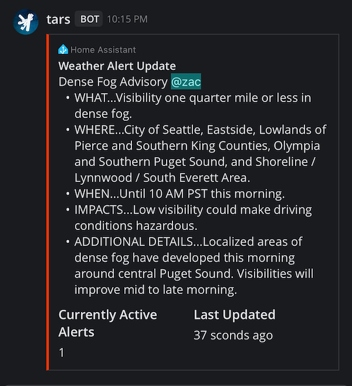
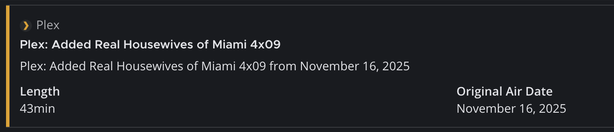

# Mattermost Notification Component for Home Assistant

[](https://github.com/zacs/ha-mattermost/actions/workflows/validate.yml)
[](https://github.com/hacs/integration)

This Home Assistant custom component lets you send notification to Mattermost servers. You can send simple or rich messages and attachments.

## Features

- **Notify Entity**: A modern Home Assistant notify entity (`notify.<server_name>`) for simple text notifications
- **`mattermost.send_message` Service**: Full-featured messaging — rich attachments, multi-channel targeting, local/remote file uploads — usable for more than just notifications
- **Assist Chat Bridge** (optional): Chat with Home Assistant via Mattermost direct messages or @mentions
- **Reconfigurable**: Update server URL, token, or default channel without deleting and re-adding the integration
- **Multiple Servers**: Configure more than one Mattermost server at once
- **Attachments**: Upload and share local or remote images/files with messages
- **Multi-Channel Support**: Send messages to multiple channels simultaneously
- **Token Authentication**: Uses both bot tokens and personal access tokens (PATs [personal access tokens] are required for Agent-style bots)

> **`notify.mattermost` is deprecated.** It still works, but new automations should use the notify entity (simple text) or the `mattermost.send_message` service (everything else) instead. See [Modern Notify Entity](#modern-notify-entity) and [`mattermost.send_message` Service](#mattermostsend_message-service) below.

## Screenshots





(Plex example uses custom author fields)

## Requirements

- A Mattermost server running 11.x
- A token (bot or personal) with appropriate (`post:all` or `post:#channel`) permissions

## Setup

1. **Create a Bot Account in Mattermost**
   - Go to your Mattermost server
   - Navigate to System Console → Integrations → Bot Accounts
   - Create a new bot account (e.g., "Home Assistant Bot")
   - Note the bot access token generated (note: NOT the token ID)

2. **Install the Component**
   - Install this component from HACS
   - Restart Home Assistant

3. **Configure via UI:**
   - Go to Configuration → Integrations
   - Add "Mattermost" integration
   - Provide:
     - Server URL (e.g., `https://chat.company.com` or `192.168.1.100:8065`)
     - Token (from step 1)
     - Default Channel (e.g., `#general` or `notifications`)
     
   **Note**: For the server URL, you can provide either a full URL like `https://chat.company.com` or just the hostname/IP like `192.168.1.100:8065` (HTTPS will be assumed).

### Reconfiguring

To update the server URL, token, or default channel for an existing integration entry, go to Settings → Devices & Services, find the Mattermost entry, and choose **Reconfigure**. There's no need to delete and re-add it.

### Multiple Servers

You can add the Mattermost integration more than once to connect to multiple servers. Each entry gets its own notify entity, connectivity sensor, and (optionally) Assist bridge; entries are labeled by server hostname (e.g. "Mattermost (chat.company.com)") so they're distinguishable in the UI. When calling `mattermost.send_message` with more than one server configured, pass `config_entry_id` to pick which one to use.

### Assist Chat Bridge (optional)

You can bridge this bot to Home Assistant's Assist feature, letting you issue voice/chat-style commands to Home Assistant from Mattermost. To enable it, go to Settings → Devices & Services → Mattermost → Configure, and turn on **Enable Assist chat bridge**. Once enabled, direct messages to the bot and @mentions of the bot in channels it belongs to are forwarded to Assist, and the reply is posted back.

**Security note**: enabling this grants Home Assistant command access to anyone who can send the bot a direct message or @mention it in a shared channel. It's off by default — only turn it on if you trust everyone with access to the bot.

## Usage

### Modern Notify Entity

Each configured Mattermost server gets a notify entity that sends plain text (optionally with a title) to that server's default channel:

```yaml
action: notify.send_message
target:
  entity_id: notify.mattermost_chat_company_com
data:
  message: "Hello from Home Assistant!"
  title: "System Alert"
```

This is the simplest path for basic notifications. For channel targeting, attachments, or file uploads, use the `mattermost.send_message` service below.

### `mattermost.send_message` Service

`mattermost.send_message` has full feature parity with `notify.mattermost` (see examples further down — every `notify.mattermost` example in this README works identically as `mattermost.send_message`, just swap the action name) and can be used outside of notification contexts too. `target` is optional and defaults to the server's configured default channel if omitted. If you have more than one Mattermost server configured, pass `config_entry_id` to select which one:

```yaml
action: mattermost.send_message
data:
  config_entry_id: "<config entry id, only needed with multiple servers>"
  message: "Hello from Home Assistant!"
  target: "general"
```

### Legacy `notify.mattermost` (deprecated)

### Basic Text Notification

```yaml
action: notify.mattermost
data:
  message: "Hello from Home Assistant!"
  target: "general"
```

### Message with Title

```yaml
action: notify.mattermost
data:
  title: "System Alert"
  message: "Motion detected in living room"
  target: "alerts"
```

### Send to Multiple Channels

```yaml
action: notify.mattermost
data:
  message: "System status update"
  target:
    - "#general"
    - "#alerts"
    - "#notifications"
```

### Send Local File

```yaml
action: notify.mattermost
data:
  message: "Security camera snapshot"
  target: "security"
  data:
    file:
      path: "/config/www/camera_snapshot.jpg"
```

### Send Remote File

```yaml
action: notify.mattermost
data:
  message: "Weather radar image"
  target: "weather"
  data:
    file:
      url: "https://example.com/radar.png"
      username: "optional_username"  # if authentication required
      password: "optional_password"
```

### Rich Message Attachments

```yaml
action: notify.mattermost
data:
  message: "System Status Report"
  target: "#monitoring"
  data:
    attachments:
      - fallback: "System Status: All systems operational"
        color: "#36a64f"
        # author_name and author_icon are automatically added by default
        # You can override them by specifying different values:
        # author_name: "Custom Name"
        # author_icon: "https://example.com/custom-icon.png"
        title: "Daily Status Report"
        title_link: "https://your-ha-instance.com"
        text: "All systems are running normally"
        fields:
          - title: "CPU Usage"
            value: "15%"
            short: true
          - title: "Memory Usage"
            value: "45%"
            short: true
          - title: "Disk Space"
            value: "82% used"
            short: false
        image_url: "https://cdn-icons-png.flaticon.com/512/1114/1114045.png"
        footer: "Generated by Home Assistant"
        footer_icon: "https://cdn-icons-png.flaticon.com/512/1114/1114045.png"
```

## Configuration Parameters

### Notification Data Options

#### File Attachments
- **file.path**: Local file path (must be in allowed directories)
- **file.url**: Remote file URL
- **file.username**: Optional username for authenticated URLs
- **file.password**: Optional password for authenticated URLs

#### Message Attachments
Rich formatting following Mattermost's attachment API.

**Note**: The integration automatically adds `author_name: "Home Assistant"` and `author_icon: "https://www.home-assistant.io/images/favicon-192x192-full.png"` to all attachments unless you explicitly specify different values.

- **fallback**: Plain text fallback for notifications (note: this is what will show up in a Mattermost push notification, so make sure you populate it if you use those)
- **color**: Hex color for attachment border (e.g., "#ff0000")
- **pretext**: Text shown above attachment
- **author_name**: Author name (defaults to "Home Assistant")
- **author_link**: URL for author name link (defaults to nothing)
- **author_icon**: 16x16px icon for author (defaults to Home Assistant favicon)
- **title**: Attachment title
- **title_link**: URL for title link
- **text**: Main attachment text (supports Markdown)
- **fields**: Array of field objects with title, value, short properties
- **image_url**: URL to image (displayed full-size)
- **thumb_url**: URL to thumbnail (75x75px)
- **footer**: Footer text
- **footer_icon**: 16x16px footer icon

## Automation Examples

### Motion Detection Alert

```yaml
automation:
  - alias: "Motion Alert"
    trigger:
      platform: state
      entity_id: binary_sensor.motion_sensor
      to: "on"
    action:
      service: notify.mattermost
      data:
        title: "🚨 Motion Detected"
        message: "Motion detected in {{ trigger.to_state.attributes.friendly_name }}"
        target: "security"
        data:
          attachments:
            - color: "#ff9900"
              author_name: "Home Assistant Security"
              fields:
                - title: "Location"
                  value: "{{ trigger.to_state.attributes.friendly_name }}"
                  short: true
                - title: "Time"
                  value: "{{ now().strftime('%Y-%m-%d %H:%M:%S') }}"
                  short: true
```

### System Status with Image

```yaml
automation:
  - alias: "Daily Status Report"
    trigger:
      platform: time
      at: "08:00:00"
    action:
      - service: camera.snapshot
        target:
          entity_id: camera.front_door
        data:
          filename: "/config/www/daily_snapshot.jpg"
      - service: notify.mattermost
        data:
          title: "Daily Home Status"
          message: "Good morning! Here's your daily status report."
          target: "family"
          data:
            file:
              path: "/config/www/daily_snapshot.jpg"
            attachments:
              - color: "#36a64f"
                author_name: "Home Assistant"
                title: "System Status"
                text: "All systems operational"
                fields:
                  - title: "Temperature"
                    value: "{{ states('sensor.temperature') }}°C"
                    short: true
                  - title: "Humidity"
                    value: "{{ states('sensor.humidity') }}%"
                    short: true
```

## Troubleshooting

### Common Issues

1. **"Invalid authentication" error**
   - Verify your bot token is correct
   - Ensure the bot has permission to post in channels
   - Check that the Mattermost server URL is accessible from the Home Assistant machine
   - If you recently deleted and recreated this integration, restart Home Assistant to clear cached data

2. **"Could not find channel" error**
   - Verify the channel name is correct (without #)
   - Ensure the bot has access to the target channel
   - Check that the channel exists

3. **File upload failures**
   - Verify file paths are in Home Assistant's allowed directories
   - Check file permissions
   - Ensure file size limits aren't exceeded
   - For remote files, verify URLs are accessible and allowed

4. **Connection timeouts**
   - Check network connectivity to Mattermost server
   - Verify server SSL certificate if using HTTPS
   - Consider increasing timeout values if on slow network

### Debugging

Enable debug logging in `configuration.yaml`:

```yaml
logger:
  logs:
    custom_components.mattermost: debug
```

## Security Considerations

These are all brought to you by Claude but are generally pretty smart...

- Store bot tokens securely using Home Assistant's secrets
- Use HTTPS for Mattermost server connections
- Limit bot permissions to only necessary channels
- Regularly rotate bot tokens
- Be cautious with file path permissions

## Contributing

Contributions welcome! Please submit issues and pull requests on the project repository. I am a total newbie to Mattermost so I may have missed opportunities, let me know. 
